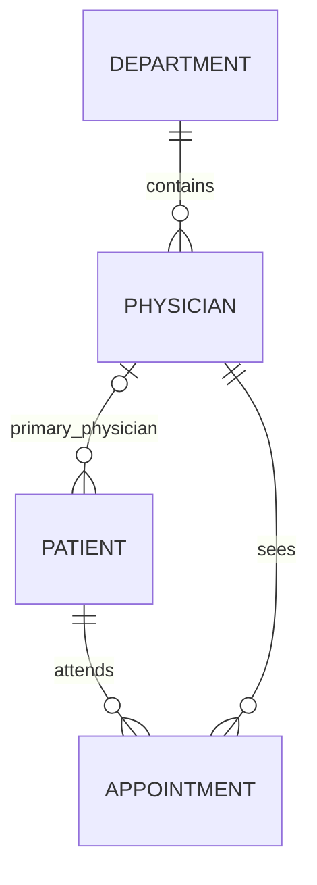

# Version 1 database

## Scope and decisions

This is the database milestone for a staff-facing Hospital Appointment Manager. It supports patient registration/editing, physician lookup, appointment workflows, and basic reports. The SQL is intended for MySQL 8.4. All demo records are fictional.

- One department per physician in V1. A patient's primary physician is optional and can differ from the physician they book.
- Patient name and birth date are required; phone and address are optional. No SSN is collected.
- All appointment `DATETIME` values are UTC. Applications must convert local input to UTC and convert results back for display. Set JDBC sessions to UTC too. Report date boundaries in the supplied examples are UTC.
- Appointment intervals are `[start, end)`: back-to-back appointments are allowed.
- Booking/rescheduling requires a future start, a later end, and no overlap with a scheduled appointment for either the patient or physician.
- Rescheduling changes times for the same patient and physician. To change either person, cancel and book a new appointment.
- Status progresses from `scheduled` to `cancelled` or `completed`. Both terminal statuses retain the record and cannot be reopened. Completion is allowed after the appointment starts.
- Cancellations release the slot. Foreign keys prevent deleting a patient or physician referenced by any appointment, including cancelled history.

## Files and application order

| File | Purpose |
| --- | --- |
| `migrations/001_schema.sql` | Creates a new `hospital_v1`, four domain tables, a scheduling lock row, and birth-date validation triggers |
| `migrations/002_scheduling.sql` | Booking, rescheduling, and status-change transactions |
| `migrations/003_views.sql` | Patient/physician directories, appointment details, daily totals |
| `migrations/004_app_role.sql` | Restricted `hospital_v1_app` database role |
| `seed.sql` | Optional fictional fixtures: three patients, three physicians, and four appointments |
| `reports.sql` | Dashboard and date-range reporting examples |
| `tests/test_database.py` | MySQL integration tests, including concurrent booking attempts |

The numbered baseline is applied once to a fresh database. It fails on an existing schema rather than overwriting it. Later changes should be new numbered migrations; the initial Docker scripts do not automatically apply new migrations to an existing volume. Apply later migrations explicitly after review.

## Entity relationships



| Entity | Fields |
| --- | --- |
| Department | Generated ID; unique, nonblank name |
| Physician | Generated ID; full name; department ID; position |
| Patient | Generated ID; full name; date of birth; phone; address; optional primary physician; timestamps |
| Appointment | Generated ID; patient/physician IDs; UTC start/end; optional visit reason; status; timestamps |

Phone numbers are text. Names are not unique: different patients can share a name or birth date. The displayed patient identifier should come from `patient_id`.

## Run locally

Follow the root [quick start](../../README.md#quick-start). The database is available on `127.0.0.1:3307`; data is stored in the Compose volume. Stop with `docker compose down`. Avoid deleting that volume when retaining records.

With an existing MySQL 8.4 installation, open an administrative MySQL session from the repository root and run:

```sql
SOURCE database/v1/migrations/001_schema.sql;
SOURCE database/v1/migrations/002_scheduling.sql;
SOURCE database/v1/migrations/003_views.sql;
SOURCE database/v1/migrations/004_app_role.sql;
SOURCE database/v1/seed.sql;
SOURCE database/v1/reports.sql;
```

Do not continue after a failed baseline migration or use the MySQL client's `--force` option. Inspect the failure before retrying; initialization is not a reset command.

## Examples for the Java backend

Use parameter binding for values. The examples below run after loading the seed on a fresh database. Procedures return normal SQL errors with messages for invalid operations; `book_appointment` returns one row containing `appointment_id`.

```sql
USE hospital_v1;
SET SESSION time_zone = '+00:00';
SELECT * FROM v_physician_directory ORDER BY department_name, full_name;

INSERT INTO patient (full_name, date_of_birth, phone, primary_physician_id)
VALUES ('Alex Example', '1992-06-15', '555-0104', 1);
SET @patient_id = LAST_INSERT_ID();

SET @start = UTC_DATE() + INTERVAL 2 DAY + INTERVAL 14 HOUR;
CALL book_appointment(@patient_id, 1, @start, @start + INTERVAL 30 MINUTE, 'Fictional visit');
SET @appointment_id = LAST_INSERT_ID();
CALL reschedule_appointment(@appointment_id, @start + INTERVAL 1 HOUR, @start + INTERVAL 90 MINUTE);
CALL set_appointment_status(@appointment_id, 'cancelled');

SELECT * FROM v_appointment_details WHERE patient_id = @patient_id;
```

Connect with `autoCommit=true` when calling these scheduling procedures: each starts, commits, or rolls back its own transaction. Do not wrap a call in Spring `@Transactional` or an existing JDBC transaction; MySQL's `START TRANSACTION` would commit an existing transaction. When using JDBC `CallableStatement`, consume the returned result and remaining update counts before reusing the connection.

## Concurrency and access

Each public scheduling procedure takes an exclusive lock on the single `scheduling_guard` row before checking or modifying appointments. Conflict checks use locking reads. Waiting requests therefore see the preceding committed booking. Errors roll back the transaction and release the guard.

This deliberately serializes scheduling writes across the small demonstration app. Patient edits and directory/report reads can run separately. Higher scheduling throughput would require a different locking design and new concurrency tests.

Overlap, future-time, and status-transition rules are enforced by the procedures. Table constraints alone cannot enforce those cross-row rules. **The app must use the `hospital_v1_app` role**, which permits reading and patient registration/editing but prohibits direct appointment writes. Administrative users can bypass the workflow and should be used only for setup and controlled fixtures.

The role does not create a login. An administrator can provision one interactively, replacing the password placeholder and choosing a host appropriate to deployment:

```sql
CREATE USER 'hospital_app'@'localhost' IDENTIFIED BY 'REPLACE_WITH_YOUR_OWN_PASSWORD';
GRANT 'hospital_v1_app' TO 'hospital_app'@'localhost';
SET DEFAULT ROLE 'hospital_v1_app' TO 'hospital_app'@'localhost';
```

The example host is for an application on the same MySQL host. Containerized deployments need a matching host grant. Do not grant `hospital_v1.*` privileges in addition to this role. Application login, staff roles, password handling, and a record-change audit trail will be implemented in later application work; this database role is service access, not user authentication.

## Integration tests

Tests use a **fresh disposable server**, create `hospital_v1` and a test account, and refuse to initialize over an existing database. Python and PyMySQL are test tools; the application stack remains Java/MySQL.

From the repository root:

```bash
docker compose --profile test up -d --wait database-test
python3 -m venv .venv
. .venv/bin/activate
python -m pip install -r database/v1/tests/requirements.txt
MYSQL_PORT=3308 MYSQL_ROOT_PASSWORD=hospital_test_only python database/v1/tests/test_database.py
# Removes only the disposable test container and its anonymous volume.
docker compose --profile test rm -sfv database-test
```

GitHub Actions runs the same suite on a fresh MySQL 8.4 service. It checks:

- Registration, editing, required fields, future birth dates, and foreign keys.
- Booking, invalid/past intervals, both kinds of overlap, adjacent appointments, and independent schedules.
- Cancellation history, slot reuse, terminal statuses, and failed-reschedule rollback.
- Database permissions that prevent bypassing scheduling routines.
- Two concurrent bookings for a physician, two for a patient, and booking racing with rescheduling.
- Directory/report queries and fictional fixture totals.

## Transition from the coursework schema

| Original concept | V1 change |
| --- | --- |
| `HospitalDB` / Java `hospitalDB` | Consistent new database name `hospital_v1` |
| `patientID`, `physicianID`, `appID` supplied manually | Generated IDs using `AUTO_INCREMENT` |
| `name`, `Dob`, `startDate`, `endDate` | Consistent names: `full_name`, `date_of_birth`, `starts_at`, `ends_at` |
| `affiliatedwith` many-to-many departments | One department per physician for V1 |
| Appointment fields | Adds visit reason, status, created/updated timestamps, and scheduling routines |
| SSN / insurance fields | Omitted from the V1 registration form and schema |
| Procedures, medications, rooms, stays, nurses | Remain in original coursework; outside the four-module V1 scope |

This baseline is not an automatic conversion of an existing database. Before importing coursework records, map identifiers, choose each physician's department, validate birth dates and appointment intervals, assign appointment statuses, and resolve overlaps. The original Java program and Workbench diagram describe the old schema; the next milestone will add the V1 Java application.

Implementation references: [MySQL locking reads](https://dev.mysql.com/doc/refman/8.4/en/innodb-locking-reads.html) and [CHECK constraints](https://dev.mysql.com/doc/refman/8.4/en/create-table-check-constraints.html).
